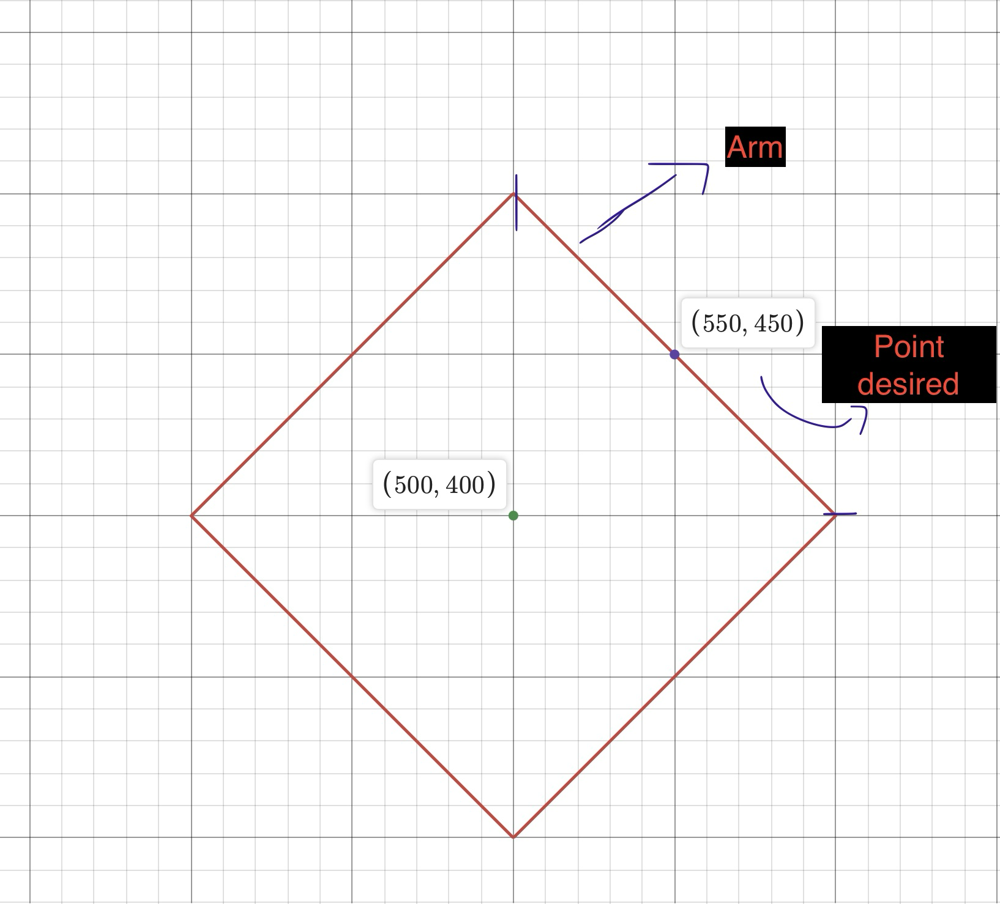
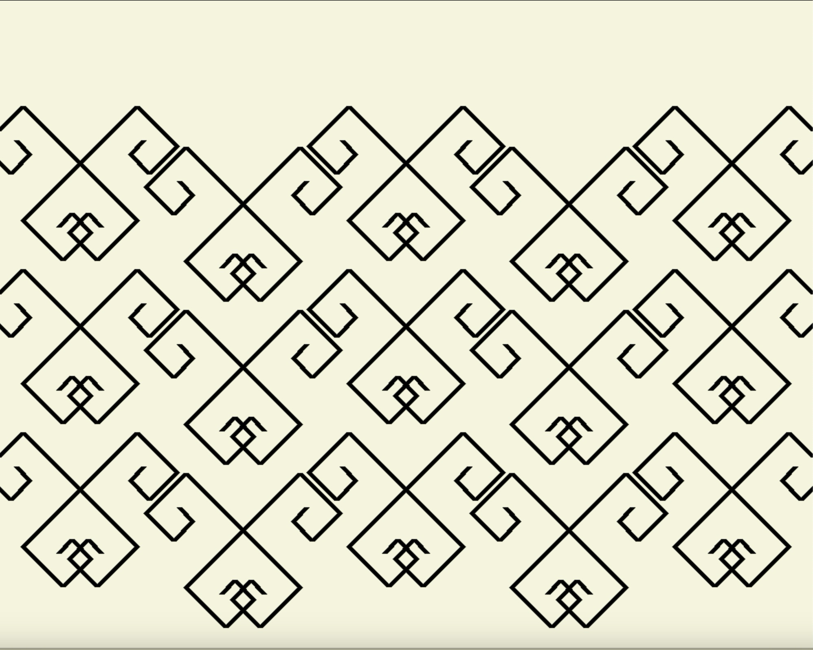

# Algorithmic Art (Grid Spiral Pattern)

Procedural generation is the creation of data or content algorithmically rather than manually.  

This project was started as a creative programming experiment, combining computer graphics, mathematics, and programming. It also allowed me to gain hands-on experience with Pygame and procedural generation.

## Table of Contents
- [**Introduction**](#introduction)
- [**Summary**](#summary)
- [**Mathematical Foundation**](#mathematical-foundation)
- [**Algorithm Breakdown**](#algorithm-breakdown)
- [**Implementation**](#implementation)
- [**How to Run**](#how-to-run)

### Introduction
This project is a creative exploration of procedural generation, combining mathematical principles with computer graphics using Pygame. The algorithm generates a unique grid-based spiral using the $L_1$ metric (Manhattan Distance), demonstrating an understanding of geometry, iteration, and algorithmic design. The project also serves as a practical implementation of procedural content generation, which is widely used in computer graphics, game development, and simulations.

### Summary
The algorithm iteratively generates line segments based on the $L_1$ metric. It starts with an initial vertical line at the center of the window and calculates new points based on a derived formula. By adjusting the sign of the computed radius, it alternates between quadrants, creating a structured spiral pattern. The algorithm updates the previous line's endpoint dynamically, storing all generated segments in a 2D array for rendering.

### Mathematical Foundation
Definition 1.0) The $L_1$ metric ( Manhattan Distance ) is a function that two points 
$P =$  ($p_1$, $p_2$, ... $p_n$) and $Q =$ ($q_1$, $q_2$, .. $q_n$) $\in$ $\mathbb{R}^n$ and maps  them to a real numbe:

$$
d(P, Q) = \sum_{i=1}^{n} |p_i - q_i|
$$

This metric is named for its resemblance to the grid-like paths in a city like Manhattan, where one can only travel along perpendicular directions.

The derived formula used has no specific name. In my research, some discrete or discrete geometry math books derive it, but no name is given. It is simply referred to as a property of the $L_1$ Metric unit sphere.

Definition 1.1) To compute any point $Q \in \mathbb{R}^2$ that lies on the arm [(Figure 1.0)](#figure-1) of the $L_1$ unit sphere from the origin $P \in \mathbb{R}^2$ point using the radius denoted as $d$. Let $k$ be an integer $\in \{ 0, 1, .... d \}$:

$$
Q = ( p_1 + k ,  p_2 + d - k  )
$$

Stated formula only works for the first quadrant. Getting the formula for other quadrants will be discussed in the mathematical derivations section. To see its code implementation see file `grid_spiral_functional.py`, line 32.

## Figure 1




### Algorithm Breakdown
This art piece ([Figure 1.1](#figure-1.1)) is generated by running an algorithm that utilizes the properties of the $L_1$ metric. Let $A$ denote the initial vertical line. Let $W$ denote the window size, which is a tuple (width, height). Let $B$ denote the new line to be derived from information of $A$ and $W$. Let  $h_a$ and  $t_a$  denote the head and tail of the line $A$, where  $h_a ,  t_a  \in \mathbb{R}^2$. The algorithm is iterative and will terminate when a desired number of steps is generated. This is determined by the constant variable `NUM_OF_STEPS`.  In each iteration, the tail of $B$ denoted by $b_t$ will be set to the head of $A$, $h_a$. The head of $B$ will be computed using the derived property of the $L_1$ metric. At the end of each iteration, $A$ will be updated to $B$, and the process repeats. This is how each segment of the grid spiral will be generated until the loop terminates.

Definition 1.2) Every phantom_line generated will be equal to the difference between the y-coordinates of $t_a$  and $h_a$.

The program begins by computing the $h_a$ and $t_a$ from the relative coordinate positioning of $A$ to the center of the window. Afterwards, the main algorithm begins by iteratively passing the head and tail of $A$ to the function `GenerateNewLines()`, which will calculate the phantom_line (Definition 1.0) and then call `ModifySpiralStep()` to scale it by `SPIRAL_STEP_SIZE` and return it. Lastly, the returned length is cast into an integer, named `radius`, and passed to the derived $L_1$ metric formula which, depending on whether the counter is odd or even, will return a point  $h_b$  in one of the Cartesian coordinate quadrants. If the radius was left as a positive value, the function will not generate a grid spiral; instead, it will create a zigzag pattern. By changing the sign of one of the radius values, a spiral pattern is achieved using the counter to alternate between the two quadrant functions.

At the end of the main algorithm loop, each point $h_b$  and  $t_b$ generated is appended to the 2D array `myLines[]`, and the points $t_a$ are set to $h_a$ and the $h_a$ is set to the new point generated $h_b$. Thus, when the algorithm starts again, the value of $A$ is set equal to the new line generated $B$. Dynamically updating the coordinates generates new line segments.

## Figure 1.1



### Implementation
Finally, at the end of the program, the grid spiral is rendered using a loop to access the indices of `myLines[]`, which stores the head and tail coordinates for each line segment previously generated. The function to draw a line in the Pygame library is:

```python
pygame.draw.line(surface, colour, start_pos, end_pos, width=1)
```

Since the coordinates are appended sequentially and stored in a 2D array (myLines[]), rendering the line segments is straightforward. A simple loop will access each index, which itself contains the head and tail coordinates for each line.

The second file `Grid_Spiral_OOP.py` is an implementation of the same algorithm described above, but following OOP principles. This was done to scale the program's ability to generate multiple grid spiral patterns while still being modular and clean to allow for maintenance and quick and easy modifications.

## How to Run
### 1. Clone the Repository
Fork the repository and clone it to your local machine:

```bash
git clone https://github.com/your-username/Grid-Spiral.git
cd Grid-Spiral
```

### 2. Install Dependencies
Ensure you have Python installed, then install the required dependencies:

```bash
pip install -r requirements.txt
```

### 3. Run the Program
Execute the script by running:

```bash
python Grid_spiral_functional.py
```

This will open a Pygame window and render the generated grid spiral.

### 4. Modify Parameters (Optional)
You can tweak the spiral generation by modifying these variables in `Grid_spiral_functional.py`:

- **`NUM_OF_STEPS`** – Adjust the number of iterations to generate a larger or smaller spiral.
- **`SPIRAL_STEP_SIZE`** – Change the spacing between spiral segments.
- **`LINE_WIDTH`** – Modify the thickness of the lines.

### 5. Object-Oriented Version
For a more modular and scalable approach, run the OOP-based version:

```bash
python Grid_Spiral_OOP.py
```

---
This project serves as a demonstration of mathematical visualization through procedural generation and provides an interactive way to explore the properties of the $L_1$ metric. Happy coding!

